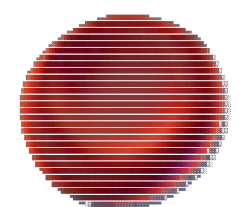

<div align="center">

  

  <br/><br/>

  # 👋 Hi, I'm **RBCs** (`RBCs-lang`)
  
  

  <br/>

  [](https://github.com/RBCs-lang)
  [](https://github.com/RBCs-lang)

</div>

<br/>

## 🚀 About Me

```javascript
const RBCs = {
    code: ["Python", "JavaScript", "CSS3", "HTML5"],
    technologies: {
        frontend: ["CSS Vanilla", "Modern Web APIs", "Interactive UIs"],
        backend: ["Micro APIs", "Node.js", "Python"],
        tools: ["Git", "GitHub Actions", "Docker"]
    },
    currentFocus: "Building high-performance Micro APIs & interactive web experiences",
    funFact: "I turn coffee into scalable code and clean design ☕"
};
```

---

##  Tech Stack & Skills

<div align="center">
  
  
  
  
  
  
</div>

---

##  GitHub Stats

<div align="center">
  
  <br/><br/>
  
</div>

---

<div align="center">
  <sub>Designed & built with ❤️ by <a href="https://github.com/RBCs-lang">RBCs</a></sub>
</div>
